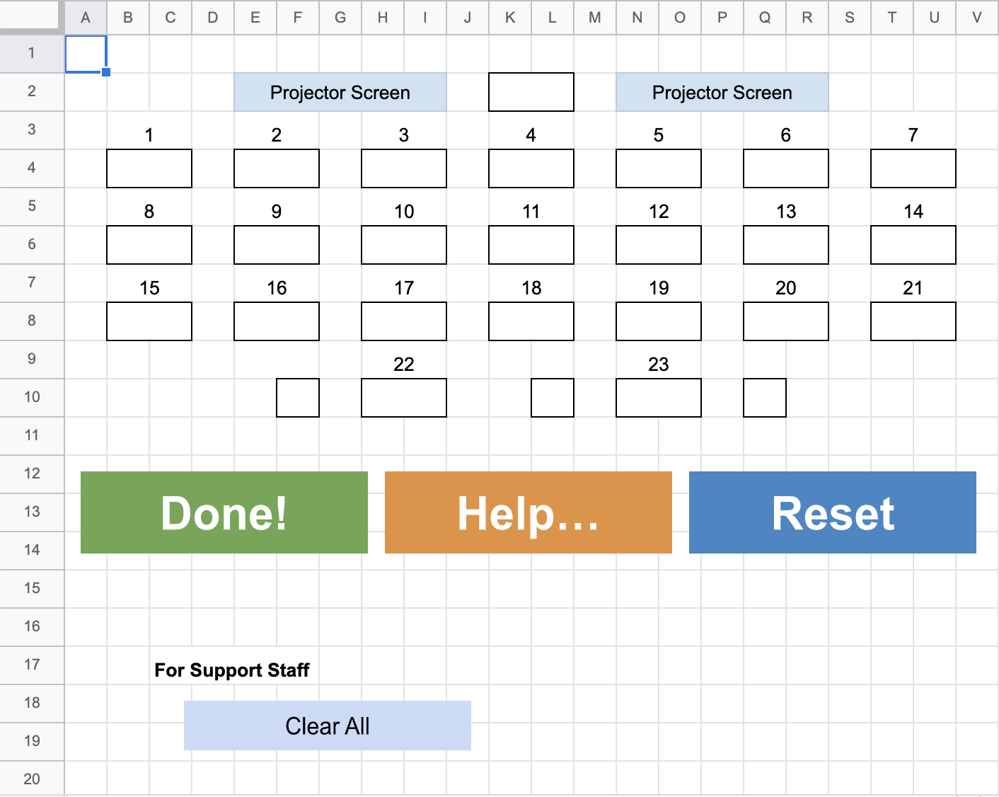

# event-sheet
ハンズオンイベントのために作成した，進捗確認&amp;ヘルプ要請シートです．

参加者の進捗状況を確認することができ，また参加者はヘルプを要請することができます．  
サポートスタッフ向けに，一斉リセット機能も設けています．

## 使い方

### 事前準備

#### 会場の再現
1. Googleスプレッドシートを作成し，任意の体裁で会場を再現します．  
1. 参加者が着席するセルを枠で囲みます．
1. 参加者が着席するセルの1つ上に，当該席に対応する番号を記載します．

#### Google Apps Scriptの作成
1. "Extensions" -> "Apps Script"から，Google Apps Scriptプロジェクトを新規作成し，[support.gs](https://github.com/tamasan238/event-sheet/blob/main/support.gs)の内容をコピーペーストします．
1. シートに戻り，任意の位置に画像あるいは"Insert" -> "Drawing"からボタン画像を作成し，配置します．
1. 各ボタン画像を右クリックし，︙から"Assign Script"をクリック．  
それぞれにdone，help，resetを割り当てます．(GASの関数名に対応しています．)
1. GASの20行目，A1:T11と記載されている箇所は，ユーザに入力された値と一致するセルを探索する際に使用する範囲を示しています．必要に応じて修正してください．

#### 共有
1. シートに戻り，右上の"Share" から任意の共有範囲を設定し，Editor権限を与えます．

### 当日
1. 会場に大型モニタを設置し，講師及びサポートスタッフが確認できるようにしておきます．
1. 参加者に，各々のPCでシートを開いてもらいます．
1. 自分が着席しているセルに，名前orニックネームを入力してもらいます．
1. 名前の入力が済んだら，実際に"Done!"を押して動作が完了したことを示してもらいます．
1. 全員の完了が確認できたら，"For Support Staff"欄の"Clear All"をクリックして色をリセットします．

## サンプル
https://docs.google.com/spreadsheets/d/1NIbt8SiQG2Slvl1oGlKbbuk43-0i9Hc93rOQEWX9auI/edit?usp=sharing

編集権限をOFFにしています．  
お試しいただく際は，"File"->"Make a Copy"から自らの環境に複製してご利用ください．

## しくみ
GASの20行目にハードコードされた範囲(デフォルトだとA1:T11)について，「ダイアログで入力された席番号」に一致する文字が含まれるセルを探し，その1つ下のセルに着色する仕組みになっています．
